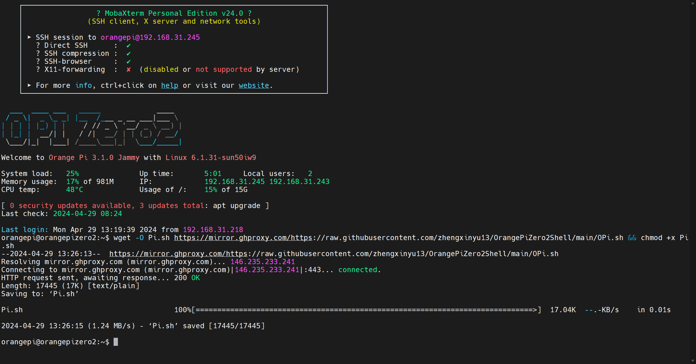
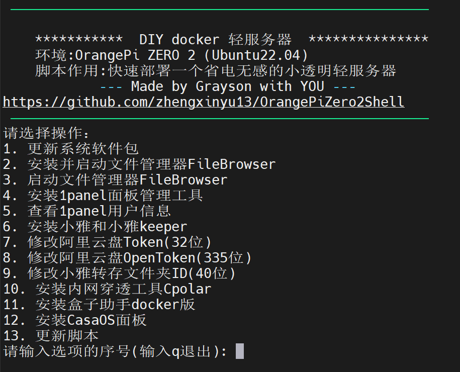

# 使用说明

在终端软件上连接香橙派。

**默认用户名：orangepi**

**默认密码：orangepi**

然后在终端执行以下命令：

```bash
wget -O Pi.sh https://mirror.ghproxy.com/https://raw.githubusercontent.com/zhengxinyu13/OrangePiZero2Shell/main/OPi.sh && chmod +x Pi.sh
```

这里已经考虑到有很多同学可能没有翻墙，所以已经对 GitHub 的链接做了加速处理，执行结果如下（如果你看到结果跟下图差不多，说明你也成功了）：



接着执行下面的命令并输入密码，就可以直接进入一键安装的操作界面了。

```bash
sudo ./Pi.sh proxy
```

如下图所示：

